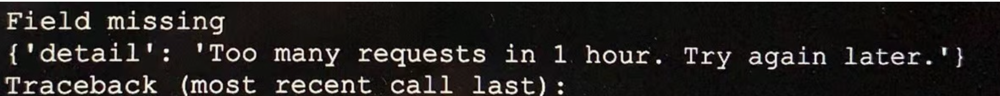
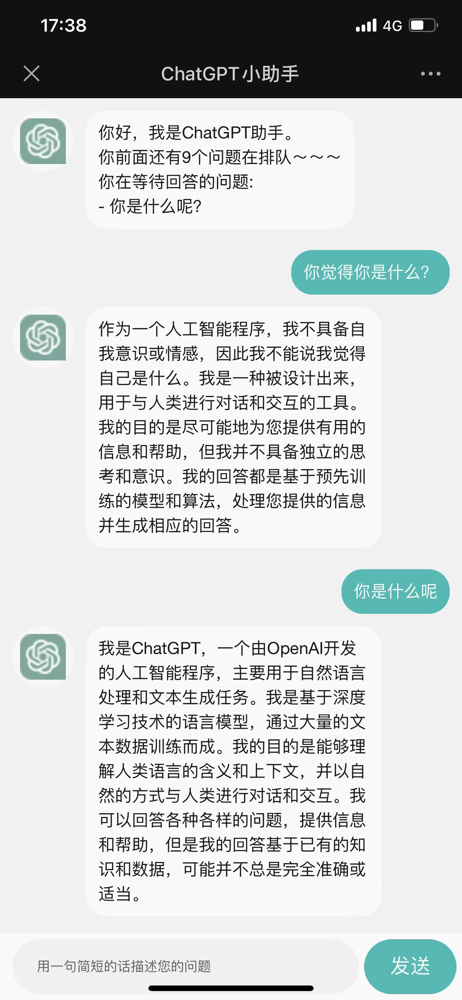

## 该项目仅供娱乐，由于openai对chatpgt有做访问限制，一小时内访问过多会被限制访问
## chatgpt-consumer.py为chatgpt简单的消费队列，可以开启多个（目前单账号不建议），部署在自己服务器玩玩就好，


* 用了 https://github.com/acheong08/ChatGPT 的api

  
## 配置环境
1. 需要安装redis

2. python环境 3.9.6,建议使用pyenv进行python版本管理
```
python -m venv venv
source venv/bin/activate
pip install -r requirements.txt
pip install devChatGPT
```
## 主要代码文件
* flask接口：devchat-api-server.py
* chatgpt消费队列：chatgpt-consumer.py
* 前端页面:chatgpt-web/pages/index/index.vue
## 配置参数
1. config.json输入你自己chatgpt的email和password
2. 前端项目 pages/index/index.vue中找到data中的url修改你自己服务器地址
## 部署
1. 前端项目参考uniapp中的配置和编译部署
2. 启动服务器接口: bash start.sh, 关闭:sh start.sh
3. 启动chatgpt消费: bash startconsumers.sh ,关闭:sh stop-consumers.sh
4. 前端工程：chatgpt-web用hbuildx打开，编译后放在nginx相关目录中即可
## 参考项目
* https://github.com/Lukium/chatgpt-api-server
* https://github.com/AIGCT/EASYChatGPT
